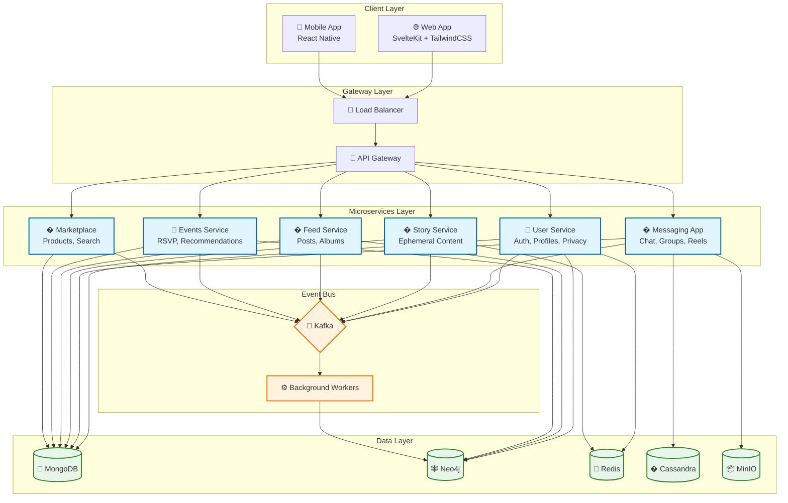

<
- [Key Features](#-key-features)
- [System Architecture](#-system-architecture)
- [Tech Stack](#-tech-stack)
- [Microservices Breakdown](#-microservices-breakdown)
- [Database Design Philosophy](#-database-design-philosophy)
- [Data Flow Patterns](#-data-flow-patterns)
- [Getting Started](#-getting-started)
- [License](#-license)

---

## 🌟 Overview

**Connectify V2** is a production-grade, distributed social networking platform engineered for hyperscale. It combines the best features of **Instagram** (Stories, Reels), **Facebook** (Events, Communities, Marketplace), and **WhatsApp** (End-to-End Encrypted Messaging) into a unified, modular architecture.

Built with **polyglot persistence**, **event-driven design**, and **FAANG-level optimizations**, Connectify is designed to handle millions of concurrent users with sub-100ms latency.

---

## ✨ Key Features

### 👤 User Management
- **Profile System** — Rich profiles with avatar, cover photo, bio, location
- **Privacy Controls** — Granular visibility settings (Public, Friends, Only Me)
- **Two-Factor Authentication** — Enhanced account security
- **End-to-End Encryption (E2EE)** — Client-side public/private key management
- **Presence System** — Real-time online/offline status with last seen

### 💬 Messaging (WhatsApp-Grade)
- **Direct Messages** — One-on-one private conversations
- **Group Chats** — Create and manage group conversations with roles
- **Message Reactions** — Emoji reactions on messages
- **Message Editing & Deletion** — Edit or soft-delete sent messages
- **Read Receipts** — Seen/delivered status indicators
- **Media Attachments** — Images, videos, voice messages via MinIO
- **Message Archiving** — Cassandra-backed infinite message history

### 📸 Stories & Reels (Instagram-Grade)
- **Ephemeral Stories** — 24-hour auto-expiring content
- **Privacy Controls** — Public, Friends, Custom, Friends-Except, Block Lists
- **View Tracking** — See who viewed your story
- **Story Reactions** — React with emojis
- **Reels** — Short-form video content

### 📰 Feed & Posts
- **Rich Posts** — Text, images, videos with hashtags
- **Comments & Replies** — Nested discussion threads
- **Reactions** — Emoji reactions on posts, comments, and replies
- **Photo Albums** — Organize media into collections
- **Hashtag Discovery** — Browse posts by hashtag

### 📅 Events
- **Event Creation** — Host public or private events
- **RSVP System** — Going, Interested, Not Going
- **Co-Host Management** — Add/remove event co-hosts
- **Event Recommendations** — AI-powered suggestions based on social graph
- **Trending Events** — Discover popular events
- **Event Categories** — Organized by type

### 🛍️ Marketplace
- **Product Listings** — Sell items with images, descriptions, pricing
- **Category Browser** — Navigate products by category
- **Search & Filter** — Advanced product search
- **Seller Profiles** — View seller information
- **View Tracking** — Track product popularity
- **Favorites** — Save products for later

### 👥 Communities
- **Community Creation** — Build interest-based groups
- **Post Moderation** — Admin approval workflows
- **Member Management** — Roles and permissions

### 🔍 Search & Discovery
- **Universal Search** — Search across users, posts, products, events
- **Friend Suggestions** — Neo4j-powered social recommendations

### 🔔 Notifications
- **Real-time Notifications** — Push and in-app alerts
- **Notification Preferences** — Granular control per category

---

## 🏗️ System Architecture



---

## 🛠️ Tech Stack

| Layer | Technology | Purpose |
|-------|------------|---------|
| **Frontend** | SvelteKit 2, TailwindCSS | Reactive UI with "Apple Liquid Glass" aesthetics |
| **Backend** | Go 1.25, gRPC, REST | High-performance microservices |
| **API Comm** | Protocol Buffers | Type-safe inter-service communication |
| **Document Store** | MongoDB 7 | User profiles, posts, events, products |
| **Graph Database** | Neo4j 5 | Social relationships, recommendations |
| **Time-Series Store** | Apache Cassandra | Chat message logs |
| **Object Storage** | MinIO | Media files (images, videos, attachments) |
| **Cache** | Redis Cluster | Session, relationship cache, rate limiting |
| **Message Queue** | Apache Kafka | Event-driven architecture |
| **Observability** | Prometheus, Jaeger | Metrics, distributed tracing |
| **Container** | Docker, Kubernetes | Deployment orchestration |

---

## � Microservices Breakdown

| Service | Port | Responsibilities |
|---------|------|------------------|
| **user-service** | 8080 / 9090 | Authentication, profiles, privacy, presence, E2EE keys |
| **messaging-app** | 8081 / 9091 | DMs, groups, reactions, archival, reels, communities |
| **story-service** | 8082 / 9092 | Ephemeral stories, view tracking, reactions |
| **feed-service** | 8083 / 9093 | Posts, comments, replies, albums, hashtags |
| **events-service** | 8084 / 9094 | Events, RSVPs, recommendations, co-hosts |
| **marketplace-service** | 8085 / 9095 | Products, categories, search, view counts |
| **shared-entity** | — | Proto definitions, shared models |

---

## 🧠 Database Design Philosophy

We employ **Polyglot Persistence** — using the right database for the right job:

| Database | Use Case | Why? |
|----------|----------|------|
| **MongoDB** | User profiles, Posts, Events, Products | Flexible schema, fast aggregations |
| **Neo4j** | Friendships, Follows, Recommendations | O(1) relationship traversal |
| **Cassandra** | Chat messages | High write throughput, linear scalability |
| **MinIO** | Media files | S3-compatible, decoupled blob storage |
| **Redis** | Session, Cache, Presence | Sub-ms latency, pub/sub |

### Key Optimizations
- **Denormalized Reads** — Seller/Category info embedded in Products
- **Read-Through Caching** — Relationship checks cached for 5 minutes
- **Async Event Processing** — View counts via Kafka + Batch Writes
- **Circuit Breakers** — Graceful degradation on service failures

---

## 🌊 Data Flow Patterns

### Synchronous Read
```
Client → API → Redis Cache (HIT?) → MongoDB → Response
```

### Async Write (Event-Driven)
```
Client → API → MongoDB (Write) → Kafka (Publish)
                                    ↓
                    Background Worker → Neo4j (Graph Sync)
```

### Messaging Flow
```
Client → Messaging App → MinIO (Upload Media)
                       → Cassandra (Store Message)
                       → WebSocket/Push (Notify Recipient)
```

---

## 🚀 Getting Started

### Prerequisites
- Docker & Docker Compose
- Go 1.25+
- Node.js 20+
- Make

### Quick Start
```bash
# Clone the repository
git clone https://github.com/MuhibNayem/connectify-v2.git
cd connectify-v2

# Start infrastructure
docker-compose up -d mongo redis kafka neo4j cassandra minio

# Configure environment
cp .env.sample .env

# Run all services
make run-all

# Start frontend
cd frontend && npm install && npm run dev
```

### Running Individual Services
```bash
cd user-service && make run
cd messaging-app && make run
cd story-service && make run
cd feed-service && make run
cd events-service && make run
cd marketplace-service && make run
```

---

## 📄 License

This project is proprietary software. All rights reserved.

---

<div align="center">
  <p><strong>Built for Scale. Designed for Millions.</strong></p>
  <p>⭐ Star this repo if you find it inspiring!</p>
</div>
]]>