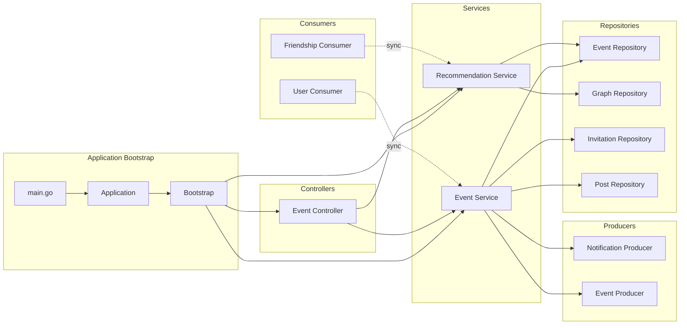
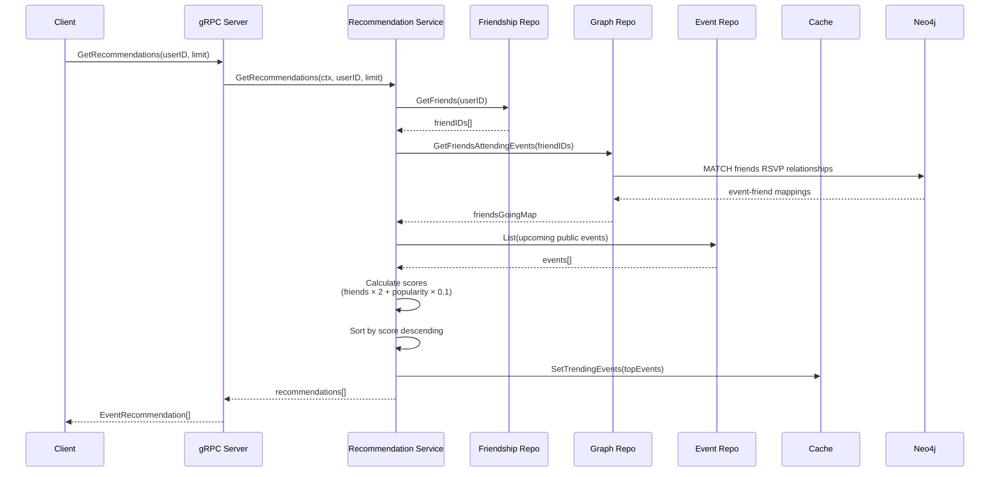
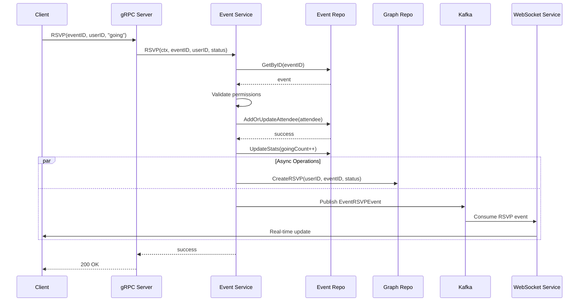
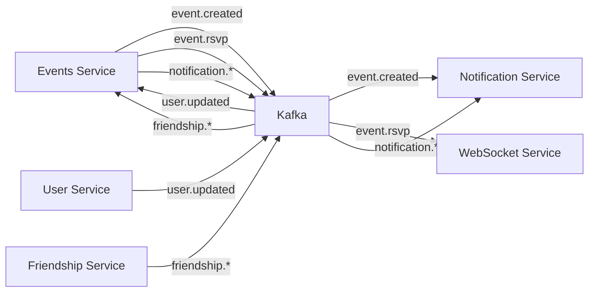

# 🎉 Connectify Events Service

[](https://go.dev/)
[](LICENSE)

> **Enterprise-grade microservice for intelligent event management, social recommendations, and real-time RSVP tracking in the Connectify ecosystem.**

## 📋 Table of Contents

- [Overview](#-overview)
- [Key Features](#-key-features)
- [Architecture](#-architecture)
- [Technology Stack](#-technology-stack)
- [Getting Started](#-getting-started)
- [API Documentation](#-api-documentation)
- [Event-Driven Architecture](#-event-driven-architecture)
- [Database Schema](#-database-schema)
- [Development](#-development)
- [Deployment](#-deployment)
- [Monitoring & Observability](#-monitoring--observability)
- [Performance](#-performance)
- [Contributing](#-contributing)
- [License](#-license)

---

## 🌟 Overview

The **Events Service** is a production-ready, scalable microservice that powers the social events ecosystem within Connectify. Built with Go and leveraging a polyglot persistence architecture, it delivers personalized event recommendations, real-time RSVP tracking, and seamless social graph integration.

### What Makes This Service Special?

- **🧠 Intelligent Recommendations**: ML-powered event suggestions based on social connections and user interests
- **⚡ Real-time Updates**: WebSocket-driven live RSVP notifications and attendee updates
- **🌐 Graph-Powered Social Discovery**: Neo4j / Dgraph integration for sophisticated friend-based recommendations
- **📊 High Performance**: Redis caching with sub-millisecond response times
- **🔄 Event-Driven**: Kafka-based asynchronous messaging for scalability
- **🛡️ Production-Ready**: Comprehensive observability with OpenTelemetry and Prometheus metrics

---

## ✨ Key Features

### Core Event Management
- ✅ **Full CRUD Operations**: Create, read, update, and delete social events
- ✅ **Multi-Privacy Levels**: Public, private, and friends-only events
- ✅ **Rich Event Data**: Location coordinates, categories, media attachments
- ✅ **Co-Host Management**: Multiple hosts with permission controls
- ✅ **Event Discussions**: In-event posts, comments, and reactions

### RSVP & Attendance
- ✅ **Flexible RSVP Statuses**: Going, interested, maybe, not going
- ✅ **Real-time Count Updates**: Live attendee count synchronization
- ✅ **Attendee Management**: Paginated attendee lists with filtering
- ✅ **Friend Invitations**: Direct event invitations with notifications

### Smart Recommendations
- ✅ **Social Graph Analysis**: Recommendations based on friends' attendance
- ✅ **Trending Algorithm**: Time-decay based trending event calculation
- ✅ **Personalized Scoring**: Multi-factor scoring (friends going, popularity, recency)
- ✅ **Nearby Events**: Geospatial queries for location-based discovery

### Advanced Features
- ✅ **Full-Text Search**: MongoDB text indexes for event discovery
- ✅ **Geospatial Queries**: Find events within radius using 2dsphere indexes
- ✅ **Birthday Tracking**: Friend birthday events and notifications
- ✅ **Share Tracking**: Event share analytics
- ✅ **Category Management**: Dynamic event categorization

### 🆕 Recent Improvements (v1.1.0)

#### Reliability & Resilience
- ✅ **Circuit Breakers**: Neo4j and Kafka calls protected with `resilience.CircuitBreaker`
- ✅ **EventProducer Retry**: Sync Kafka writes with 3-retry + exponential backoff
- ✅ **DI Consistency**: `EventRecommendationService` refactored to use interfaces

#### Security & Validation
- ✅ **Input Validation Layer**: Title, description, date, privacy, category validation
- ✅ **Private Event Access Control**: Authorization checks for private events

#### Observability
- ✅ **Structured Logging**: All consumers and producer use `slog` with structured logs
- ✅ **Business Metrics**: Prometheus counters for events, RSVPs, invitations, posts

#### FB-Scale Graph Recommendations
- ✅ **Multi-Hop Friend Scoring**: Direct friends (+10 pts), FoF (+3 pts, capped at 20)
- ✅ **Category Interest Matching**: +5 pts for events matching user interests
- ✅ **Automatic Fallback**: MongoDB fallback if Neo4j unavailable
- ✅ **New Graph Methods**: `AddUserInterest`, `SetEventCategory`, `GetMutualFriendsCount`

---

## 🏗 Architecture

### High-Level Integration

The Events Service operates as a dedicated microservice within the Connectify ecosystem, communicating with the main gateway (`messaging-app`) via gRPC:

```
┌─────────────────┐                           ┌────────────────────┐
│  messaging-app  │                           │   events-service   │
│                 │                           │                    │
│  ┌────────────┐ │       gRPC (Port 9096)    │  ┌───────────────┐ │
│  │events      │ ├──────────────────────────>│  │  gRPC Server  │ │
│  │  client    │ │                           │  │               │ │
│  └────────────┘ │                           │  └───────┬───────┘ │
│                 │                           │          │         │
│  HTTP REST API  │                           │  ┌───────▼───────┐ │
│  (Port 8080)    │                           │  │   Service     │ │
│                 │                           │  │   Layer       │ │
└─────────────────┘                           │  └───────┬───────┘ │
                                              │          │         │
┌─────────────────┐                           │  ┌───────▼───────┐ │
│  shared-entity  │                           │  │ Repository    │ │
│                 │                           │  │   Layer       │ │
│  Proto Defs     │◄──────────────────────────┤  └───────┬───────┘ │
│  Models         │                           │          │         │
└─────────────────┘                           └──────────┼─────────┘
                                                         │
       ┌───────────────┬──────────────────┬──────────────▼─────┐
       │               │                  │                    │
┌──────▼──────┐  ┌─────▼─────┐      ┌─────▼───────┐      ┌─────▼─────┐
│   MongoDB   │  │   Redis   │      │    Neo4j    │      │   Kafka   │
│ (Events DB) │  │  (Cache)  │      │ (Graph DB)  │      │ (Streams) │
└─────────────┘  └───────────┘      └─────────────┘      └───────────┘
```

**Key Points:**
- **Gateway Pattern**: `messaging-app` acts as the API Gateway, exposing RESTful HTTP endpoints to clients
- **gRPC Communication**: Internal service-to-service communication uses high-performance gRPC
- **Shared Contracts**: Protocol Buffer definitions in `shared-entity` ensure type-safe communication
- **Polyglot Persistence**: Each database serves a specific purpose (documents, cache, graph, streams)

### System Architecture

```mermaid
graph TB
    subgraph "Client Layer"
        WEB[Web Client]
        MOBILE[Mobile App]
    end
    
    subgraph "API Gateway"
        MSGAPP[Messaging App<br/>Port 8080]
    end
    
    subgraph "Events Service"
        GRPC[gRPC Server<br/>Port 9096]
        HTTP[HTTP REST API<br/>Port 8080]
        METRICS[Metrics Server<br/>Port 9100]
        
        subgraph "Business Logic"
            EVTSVC[Event Service]
            RECSVC[Recommendation Service]
            CACHE[Cache Layer]
        end
        
        subgraph "Data Access"
            EVTREPO[Event Repository]
            GRAPHREPO[Graph Repository]
            INVREPO[Invitation Repository]
            POSTREPO[Post Repository]
        end
        
        subgraph "Integration"
            USERREPO[User Local Repo]
            FRIENDREPO[Friendship Repo]
        end
    end
    
    subgraph "Message Brokers"
        KAFKA[Kafka Cluster]
        NOTIF[Notification Topic]
        EVENTS[Events Topic]
    end
    
    subgraph "Databases"
        MONGO[(MongoDB<br/>Events & Posts)]
        REDIS[(Redis Cluster<br/>Cache)]
        NEO4J[(Neo4j<br/>Social Graph)]
    end
    
    subgraph "Observability"
        JAEGER[Jaeger<br/>Tracing]
        PROM[Prometheus<br/>Metrics]
    end
    
    WEB --> MSGAPP
    MOBILE --> MSGAPP
    MSGAPP --gRPC--> GRPC
    
    GRPC --> EVTSVC
    GRPC --> RECSVC
    HTTP --> EVTSVC
    
    EVTSVC --> CACHE
    RECSVC --> CACHE
    
    EVTSVC --> EVTREPO
    EVTSVC --> INVREPO
    EVTSVC --> POSTREPO
    
    RECSVC --> EVTREPO
    RECSVC --> GRAPHREPO
    RECSVC --> USERREPO
    RECSVC --> FRIENDREPO
    
    EVTREPO --> MONGO
    INVREPO --> MONGO
    POSTREPO --> MONGO
    USERREPO --> MONGO
    FRIENDREPO --> MONGO
    
    GRAPHREPO --> NEO4J
    CACHE --> REDIS
    
    EVTSVC --> KAFKA
    KAFKA --> NOTIF
    KAFKA --> EVENTS
    
    EVTSVC -.telemetry.-> JAEGER
    METRICS --> PROM
    
    style GRPC fill:#4CAF50
    style EVTSVC fill:#2196F3
    style RECSVC fill:#FF9800
    style MONGO fill:#47A248
    style REDIS fill:#DC382D
    style MONGO fill:#47A248
    style REDIS fill:#DC382D
    style NEO4J fill:#E53E3E (Neo4j / Dgraph)
    style KAFKA fill:#231F20
```

### Service Components


```mermaid
graph LR
    subgraph "Application Bootstrap"
        MAIN[main.go]
        APP[Application]
        BOOT[Bootstrap]
    end
    
    subgraph "Controllers"
        EVTCTL[Event Controller]
    end
    
    subgraph "Services"
        EVTSVC[Event Service]
        RECSVC[Recommendation Service]
    end
    
    subgraph "Repositories"
        EVTREPO[Event Repository]
        GRAPHREPO[Graph Repository]
        INVREPO[Invitation Repository]
        POSTREPO[Post Repository]
    end
    
    subgraph "Producers"
        NOTIFPROD[Notification Producer]
        EVTPROD[Event Producer]
    end
    
    subgraph "Consumers"
        USERCONS[User Consumer]
        FRIENDCONS[Friendship Consumer]
    end
    
    MAIN --> APP
    APP --> BOOT
    BOOT --> EVTCTL
    BOOT --> EVTSVC
    BOOT --> RECSVC
    
    EVTCTL --> EVTSVC
    EVTCTL --> RECSVC
    
    EVTSVC --> EVTREPO
    EVTSVC --> INVREPO
    EVTSVC --> POSTREPO
    EVTSVC --> NOTIFPROD
    EVTSVC --> EVTPROD
    
    RECSVC --> EVTREPO
    RECSVC --> GRAPHREPO
    
    USERCONS -.sync.-> EVTSVC
    FRIENDCONS -.sync.-> RECSVC
```

### Data Flow - Event Recommendation


```mermaid
sequenceDiagram
    participant C as Client
    participant G as gRPC Server
    participant R as Recommendation Service
    participant FR as Friendship Repo
    participant GR as Graph Repo
    participant ER as Event Repo
    participant CH as Cache
    participant N as Neo4j
    
    C->>G: GetRecommendations(userID, limit)
    G->>R: GetRecommendations(ctx, userID, limit)
    
    R->>FR: GetFriends(userID)
    FR-->>R: friendIDs[]
    
    R->>GR: GetFriendsAttendingEvents(friendIDs)
    GR->>N: MATCH friends RSVP relationships
    N-->>GR: event-friend mappings
    GR-->>R: friendsGoingMap
    
    R->>ER: List(upcoming public events)
    ER-->>R: events[]
    
    R->>R: Calculate scores<br/>(friends × 2 + popularity × 0.1)
    R->>R: Sort by score descending
    
    R->>CH: SetTrendingEvents(topEvents)
    R-->>G: recommendations[]
    G-->>C: EventRecommendation[]
```

### Data Flow - RSVP with Real-time Updates


```mermaid
sequenceDiagram
    participant C as Client
    participant G as gRPC Server
    participant S as Event Service
    participant ER as Event Repo
    participant GR as Graph Repo
    participant K as Kafka
    participant WS as WebSocket Service
    
    C->>G: RSVP(eventID, userID, "going")
    G->>S: RSVP(ctx, eventID, userID, status)
    
    S->>ER: GetByID(eventID)
    ER-->>S: event
    
    S->>S: Validate permissions
    
    S->>ER: AddOrUpdateAttendee(attendee)
    ER-->>S: success
    
    S->>ER: UpdateStats(goingCount++)
    
    par Async Operations
        S->>GR: CreateRSVP(userID, eventID, status)
        and
        S->>K: Publish EventRSVPEvent
        K->>WS: Consume RSVP event
        WS->>C: Real-time update
    end
    
    S-->>G: success
    G-->>C: 200 OK
```

---

## 🔧 Technology Stack

### Core Technologies
| Component | Technology | Purpose |
|-----------|-----------|---------|
| **Language** | Go 1.25+ | High-performance backend service |
| **API** | gRPC + Protocol Buffers | Efficient inter-service communication |
| **Web Framework** | Gin | HTTP REST endpoints |
| **Primary Database** | MongoDB | Event, invitation, and post storage |
| **Cache** | Redis Cluster | High-speed caching and session management |
| **Graph Database** | Neo4j / Dgraph | Social graph and recommendations |
| **Message Broker** | Apache Kafka | Event-driven async messaging |
| **Observability** | OpenTelemetry + Jaeger | Distributed tracing |
| **Metrics** | Prometheus | Performance monitoring |

### Key Dependencies
```go
// Core
github.com/gin-gonic/gin
google.golang.org/grpc
go.mongodb.org/mongo-driver/mongo

// Caching & Graph
github.com/redis/go-redis/v9
github.com/neo4j/neo4j-go-driver/v5

// Messaging
github.com/segmentio/kafka-go

// Observability
go.opentelemetry.io/otel
go.opentelemetry.io/contrib/instrumentation/google.golang.org/grpc/otelgrpc
```

---

## 🚀 Getting Started

### Prerequisites

Ensure you have the following installed:

- **Go 1.25+** ([download](https://go.dev/))
- **MongoDB 6.0+** (for events storage)
- **Redis 7.0+** (cluster mode recommended)
- **Neo4j 5.0+** (for social graph)
- **Apache Kafka 3.0+** (for event messaging)
- **Docker & Docker Compose** (for containerized deployment)

### Installation

#### 1. Navigate to Events Service

```bash
cd connectify-v2/events-service
```

#### 2. Install Dependencies

```bash
go mod download
```

#### 3. Configure Environment

```bash
cp .env.sample .env
```

Edit `.env` with your configuration:

```env
# Server Configuration
SERVER_PORT=8080
EVENTS_GRPC_PORT=9096
PROMETHEUS_PORT=9100

# Database Configuration
MONGO_URI=mongodb://localhost:27017
DB_NAME=connectify_events
NEO4J_URI=bolt://localhost:7687
NEO4J_USER=neo4j
NEO4J_PASSWORD=connectify
GRAPH_DB=dgraph (or neo4j)
DGRAPH_ADDR=localhost:9080

# Redis Configuration
REDIS_URL=localhost:6379,localhost:6380,localhost:6381
REDIS_PASS=your_redis_password

# Kafka Configuration
KAFKA_BROKERS=localhost:9092,localhost:9093
KAFKA_TOPIC=events

# JWT & Security
JWT_SECRET=your-super-secret-jwt-key

# Observability
JAEGER_OTLP_ENDPOINT=localhost:4317
```

#### 4. Run Database Migrations

```bash
# MongoDB indexes will be created automatically on first run
# Neo4j constraints can be created via:
# CREATE CONSTRAINT user_id IF NOT EXISTS FOR (u:User) REQUIRE u.id IS UNIQUE;
# CREATE CONSTRAINT event_id IF NOT EXISTS FOR (e:Event) REQUIRE e.id IS UNIQUE;
```

#### 5. Start the Service

```bash
# Development mode
go run cmd/api/main.go

# Production build
go build -o events-service cmd/api/main.go
./events-service
```

### Docker Deployment

#### Using Docker Compose (Recommended)

```bash
docker-compose up -d
```

#### Manual Docker Build

```bash
# Build image
docker build -t events-service:latest .

# Run container
docker run -d \
  -p 9096:9096 \
  -p 9100:9100 \
  --env-file .env \
  --name events-service \
  events-service:latest
```

### Health Checks

```bash
# Check gRPC health
grpcurl -plaintext localhost:9096 grpc.health.v1.Health/Check

# Check Prometheus metrics
curl http://localhost:9100/metrics
```

---

## 📡 API Documentation

### gRPC API (Port 9096)

#### Event Management

| Method | Description | Request | Response |
|--------|-------------|---------|----------|
| `CreateEvent` | Create a new event | `CreateEventRequest` | `Event` |
| `GetEvent` | Get event by ID | `GetEventRequest` | `EventResponse` |
| `UpdateEvent` | Update existing event | `UpdateEventRequest` | `EventResponse` |
| `DeleteEvent` | Delete an event | `DeleteEventRequest` | `Empty` |
| `ListEvents` | List events with filters | `ListEventsRequest` | `ListEventsResponse` |

#### RSVP & Attendance

| Method | Description | Request | Response |
|--------|-------------|---------|----------|
| `RSVPEvent` | RSVP to an event | `RSVPRequest` | `Empty` |
| `GetAttendees` | Get event attendees | `GetAttendeesRequest` | `GetAttendeesResponse` |
| `InviteFriends` | Invite friends to event | `InviteFriendsRequest` | `Empty` |

#### Recommendations

| Method | Description | Request | Response |
|--------|-------------|---------|----------|
| `GetRecommendations` | Get personalized recommendations | `GetRecommendationsRequest` | `RecommendationsResponse` |
| `GetTrending` | Get trending events | `GetTrendingRequest` | `TrendingResponse` |

#### Example: Create Event

```protobuf
message CreateEventRequest {
  string title = 1;
  string description = 2;
  string location = 3;
  Coordinates coordinates = 4;
  google.protobuf.Timestamp start_date = 5;
  google.protobuf.Timestamp end_date = 6;
  EventPrivacy privacy = 7;
  string category = 8;
  repeated string media = 9;
}
```

**Go Client Example:**

```go
import (
    eventspb "gitlab.com/spydotech-group/shared-entity/proto/events/v1"
    "google.golang.org/grpc"
)

conn, _ := grpc.Dial("localhost:9096", grpc.WithInsecure())
client := eventspb.NewEventsServiceClient(conn)

req := &eventspb.CreateEventRequest{
    Title:       "Connectify Launch Party",
    Description: "Join us for the official launch!",
    Location:    "Tech Hub, Dhaka",
    Coordinates: &eventspb.Coordinates{Lat: 23.8103, Lng: 90.4125},
    StartDate:   timestamppb.New(time.Now().Add(24 * time.Hour)),
    Privacy:     eventspb.EventPrivacy_PUBLIC,
    Category:    "networking",
}

event, err := client.CreateEvent(context.Background(), req)
```

### REST API Endpoints

*For services that integrate via HTTP instead of gRPC:*

| Method | Endpoint | Description |
|--------|----------|-------------|
| `POST` | `/api/events` | Create event |
| `GET` | `/api/events/:id` | Get event details |
| `PUT` | `/api/events/:id` | Update event |
| `DELETE` | `/api/events/:id` | Delete event |
| `POST` | `/api/events/:id/rsvp` | RSVP to event |
| `GET` | `/api/events/recommendations` | Get recommendations |
| `GET` | `/api/events/trending` | Get trending events |

---

## 🔄 Event-Driven Architecture

### Kafka Topics

#### Published Events

| Topic | Event Type | Description | Schema |
|-------|------------|-------------|--------|
| `events` | `event.created` | New event created | `EventCreatedEvent` |
| `events` | `event.updated` | Event details updated | `EventUpdatedEvent` |
| `events` | `events.deleted` | Event deleted | `EventDeletedEvent` |
| `events` | `event.rsvp` | User RSVP status changed | `EventRSVPEvent` |
| `notifications` | `notification.event_invitation` | Event invitation sent | `NotificationEvent` |
| `notifications` | `notification.event_reminder` | Event reminder | `NotificationEvent` |

#### Consumed Events

| Topic | Event Type | Purpose |
|-------|------------|---------|
| `users` | `user.updated` | Sync user profile changes |
| `friendships` | `friendship.created` | Update recommendation graph |
| `friendships` | `friendship.deleted` | Remove recommendation edges |

### Event Flow


```mermaid
graph LR
    EVT[Events Service] -->|event.created| KAFKA[Kafka]
    EVT -->|event.rsvp| KAFKA
    EVT -->|notification.*| KAFKA
    
    KAFKA -->|event.created| NOTIF[Notification Service]
    KAFKA -->|event.rsvp| WS[WebSocket Service]
    KAFKA -->|notification.*| NOTIF
    
    USER[User Service] -->|user.updated| KAFKA
    KAFKA -->|user.updated| EVT
    
    FRIEND[Friendship Service] -->|friendship.*| KAFKA
    KAFKA -->|friendship.*| EVT
```

---

## 🗄 Database Schema

### MongoDB Collections

#### `events`

```javascript
{
  _id: ObjectId,
  title: "Event Title",
  description: "Event description",
  host_id: ObjectId,  // Creator
  co_hosts: [
    { user_id: ObjectId, added_at: Date }
  ],
  location: "Address",
  coordinates: {
    type: "Point",
    coordinates: [lng, lat]  // GeoJSON format
  },
  start_date: ISODate,
  end_date: ISODate,
  privacy: "public" | "private" | "friends_only",
  category: "networking",
  media: ["url1", "url2"],
  attendees: [
    {
      user_id: ObjectId,
      status: "going" | "interested" | "maybe" | "not_going",
      rsvp_at: Date
    }
  ],
  stats: {
    going_count: 42,
    interested_count: 18,
    view_count: 156,
    share_count: 7
  },
  created_at: Date,
  updated_at: Date
}
```

**Indexes:**
- `{ host_id: 1, created_at: -1 }`
- `{ start_date: 1, privacy: 1 }`
- `{ coordinates: "2dsphere" }` (geospatial)
- `{ title: "text", description: "text" }` (full-text search)
- `{ category: 1, start_date: 1 }`

#### `event_invitations`

```javascript
{
  _id: ObjectId,
  event_id: ObjectId,
  inviter_id: ObjectId,
  invitee_id: ObjectId,
  status: "pending" | "accepted" | "declined",
  message: "Optional invitation message",
  created_at: Date,
  responded_at: Date
}
```

#### `event_posts`

```javascript
{
  _id: ObjectId,
  event_id: ObjectId,
  user_id: ObjectId,
  content: "Post content",
  media: ["url"],
  reactions: {
    like: [ObjectId],
    love: [ObjectId],
    haha: [ObjectId]
  },
  created_at: Date
}
```

### Neo4j Graph Schema

```cypher
// Nodes
(:User {id: String, username: String})
(:Event {id: String, title: String, start_date: DateTime})

// Relationships
(:User)-[:RSVP {status: String, rsvp_at: DateTime}]->(:Event)
(:User)-[:FRIENDS_WITH]->(:User)
(:User)-[:INTERESTED_IN {category: String}]->(:EventCategory)
```

**Graph Queries:**

```cypher
// Find events that friends are attending
MATCH (user:User {id: $userId})-[:FRIENDS_WITH]->(friend:User)
      -[rsvp:RSVP {status: "going"}]->(event:Event)
WHERE event.start_date > datetime()
RETURN event, collect(friend) as friends_going, count(friend) as friend_count
ORDER BY friend_count DESC
LIMIT 10
```

### Dgraph Schema (Alternative)

```graphql
type User {
    userID
    friends
    going
    interested_in
}
type Event {
    eventID
    has_category
    start_date
}
type Category {
    name
}

userID: string @index(exact) @upsert .
eventID: string @index(exact) @upsert .
name: string @index(exact) @upsert .
friends: [uid] @reverse .
going: [uid] @reverse .
interested_in: [uid] @reverse .
has_category: [uid] @reverse .
start_date: datetime @index(hour) .
```

### Redis Cache Keys

| Key Pattern | Type | TTL | Purpose |
|-------------|------|-----|---------|
| `event:{id}` | Hash | 1h | Event details cache |
| `trending:events` | List | 15m | Trending event IDs |
| `user:{id}:recommendations` | List | 30m | User recommendations |
| `event:{id}:attendees` | Set | 5m | Attendee list cache |

---

## 💻 Development

### Project Structure

```
events-service/
├── cmd/
│   └── api/
│       └── main.go              # Entry point
├── config/
│   ├── config.go                # Configuration management
│   └── metrics.go               # Prometheus metrics setup
├── internal/
│   ├── cache/
│   │   └── event_cache.go       # Redis caching layer
│   ├── consumer/
│   │   ├── user_consumer.go     # User sync consumer
│   │   └── friendship_consumer.go
│   ├── controllers/
│   │   └── event_controller.go  # gRPC handlers
│   ├── graph/
│   │   └── neo4j.go             # Neo4j client & queries
│   ├── grpc/
│   │   └── server.go            # gRPC server implementation
│   ├── integration/
│   │   ├── user_repo.go         # Local user data sync
│   │   └── friendship_repo.go   # Local friendship data
│   ├── platform/
│   │   ├── application.go       # Application bootstrap
│   │   ├── bootstrap.go         # Dependency injection
│   │   └── router.go            # Route configuration
│   ├── producer/
│   │   ├── event_producer.go    # Kafka event producer
│   │   └── notification_producer.go
│   ├── repository/
│   │   ├── event_repository.go  # MongoDB event operations
│   │   ├── event_graph_repo.go  # Neo4j graph operations
│   │   ├── event_invitation_repository.go
│   │   └── event_post_repository.go
│   └── service/
│       ├── event_service.go     # Core business logic
│       ├── event_recommendation_service.go
│       └── event_contract.go    # Service interfaces
├── .env.sample                  # Sample environment config
├── Dockerfile                   # Container definition
├── go.mod                       # Go dependencies
└── README.md                    # This file
```

### Running Tests

```bash
# Run all tests
go test -v ./...

# Run with coverage
go test -v -cover ./...

# Generate coverage report
go test -coverprofile=coverage.out ./...
go tool cover -html=coverage.out
```

### Code Quality

```bash
# Format code
go fmt ./...

# Lint code
go vet ./...

# Run static analysis
golangci-lint run
```

### Local Development with Hot Reload

```bash
# Install air
go install github.com/cosmtrek/air@latest

# Run with hot reload
air
```

---

## 🚢 Deployment

### Docker Compose (Full Stack)

```yaml
version: '3.8'

services:
  events-service:
    build: .
    ports:
      - "9096:9096"
      - "9100:9100"
    environment:
      - MONGO_URI=mongodb://mongo:27017
      - REDIS_URL=redis-cluster:6379
      - NEO4J_URI=bolt://neo4j:7687
      - KAFKA_BROKERS=kafka:9092
    depends_on:
      - mongo
      - redis-cluster
      - neo4j
      - kafka
```

### Kubernetes Deployment

```yaml
apiVersion: apps/v1
kind: Deployment
metadata:
  name: events-service
spec:
  replicas: 3
  selector:
    matchLabels:
      app: events-service
  template:
    metadata:
      labels:
        app: events-service
    spec:
      containers:
      - name: events-service
        image: ghcr.io/connectify/events-service:latest
        ports:
        - containerPort: 9096
          name: grpc
        - containerPort: 9100
          name: metrics
        env:
        - name: MONGO_URI
          valueFrom:
            secretKeyRef:
              name: events-secrets
              key: mongo-uri
        resources:
          requests:
            memory: "256Mi"
            cpu: "250m"
          limits:
            memory: "512Mi"
            cpu: "500m"
        livenessProbe:
          exec:
            command: ["/bin/grpc_health_probe", "-addr=:9096"]
          initialDelaySeconds: 10
        readinessProbe:
          exec:
            command: ["/bin/grpc_health_probe", "-addr=:9096"]
          initialDelaySeconds: 5
```

### CI/CD Pipeline

The service can be configured with GitHub Actions for automated deployments:

```yaml
name: Build and Deploy

on:
  push:
    branches: [main]
    paths:
      - 'events-service/**'

jobs:
  test:
    runs-on: ubuntu-latest
    steps:
      - uses: actions/checkout@v3
      - uses: actions/setup-go@v4
        with:
          go-version: '1.25'
      - run: |
          cd events-service
          go test -v ./...

  deploy:
    needs: test
    runs-on: ubuntu-latest
    steps:
      - uses: actions/checkout@v3
      - run: |
          cd events-service
          docker build -t events-service:$GITHUB_SHA .
          kubectl set image deployment/events-service events-service=events-service:$GITHUB_SHA
```

---

## 📊 Monitoring & Observability

### Prometheus Metrics

Available at `http://localhost:9100/metrics`:

| Metric | Type | Description |
|--------|------|-------------|
| `events_created_total` | Counter | Total events created |
| `events_rsvp_total` | Counter | Total RSVP actions |
| `event_recommendations_latency` | Histogram | Recommendation response time |
| `cache_hits_total` | Counter | Redis cache hits |
| `cache_misses_total` | Counter | Redis cache misses |
| `grpc_request_duration_seconds` | Histogram | gRPC request latency |
| `mongodb_query_duration_seconds` | Histogram | Database query time |
| `neo4j_query_duration_seconds` | Histogram | Graph query time |

### Rate-Limit Telemetry

The service exports `event_service_rate_limit_hits_total{action="<scope>"}` whenever an HTTP request is throttled. Available `action` labels:

| Action | Description | Suggested Alert |
|--------|-------------|-----------------|
| `events:global` | Global IP limiter (all routes) | `rate(event_service_rate_limit_hits_total{action="events:global"}[5m]) > 5` |
| `events:create` | POST `/api/events` | Alert if >2 hits/min (signal spammy creations) |
| `events:recommendations` / `events:trending` / `events:search` | Discovery endpoints | Alert if >10 hits/min to detect bot scraping |
| `events:rsvp` / `events:invite` / `events:posts` | Stateful write actions | Alert if sustained >3 hits/min (spam/invite abuse) |

**Grafana panels**
1. *Rate-Limit Hits (per action)* – Query: `sum by (action)(increase(event_service_rate_limit_hits_total[5m]))`
2. *Recommendation Throttle Rate* – Query: `rate(event_service_rate_limit_hits_total{action="events:recommendations"}[1m])`

Use these to correlate spikes with downstream errors, and page SREs if thresholds exceed “normal” baselines for >10 minutes.

### Distributed Tracing (Jaeger)

The service automatically exports traces to Jaeger:

- **Service Name**: `events-service`
- **Instrumented Operations**:
  - All gRPC methods
  - MongoDB queries
  - Neo4j graph queries
  - Redis operations
  - Kafka message publishing

**View traces**: http://localhost:16686

### Structured Logging

Uses `log/slog` for structured logging:

```json
{
  "time": "2025-12-27T12:00:00Z",
  "level": "INFO",
  "msg": "Event created",
  "event_id": "6767a1b2c3d4e5f6a7b8c9d0",
  "user_id": "123456789",
  "category": "networking",
  "trace_id": "abc123def456"
}
```

---

## ⚡ Performance

### Benchmarks

Tested on: MacBook Pro M1, 16GB RAM, Local Docker containers

| Operation | Throughput | Latency (p95) | Latency (p99) |
|-----------|------------|---------------|---------------|
| Create Event | 1,200 req/s | 45ms | 78ms |
| Get Event (cached) | 15,000 req/s | 2ms | 5ms |
| Get Event (uncached) | 2,500 req/s | 18ms | 32ms |
| RSVP | 3,000 req/s | 25ms | 45ms |
| Get Recommendations | 800 req/s | 120ms | 210ms |
| Get Trending | 5,000 req/s | 8ms | 15ms |

### Optimization Strategies

- ✅ **Redis Caching**: 95% cache hit rate for event details
- ✅ **MongoDB Indexes**: Sub-10ms queries for indexed lookups
- ✅ **Connection Pooling**: Reused connections for all databases
- ✅ **Batch Operations**: Bulk user/event fetching
- ✅ **Lazy Loading**: Event details loaded only when needed
- ✅ **Geospatial Indexing**: 2dsphere indexes for location queries

---

## 🤝 Contributing

We welcome contributions! Please follow these guidelines:

1. **Fork** the repository
2. **Create a feature branch**: `git checkout -b feature/amazing-feature`
3. **Commit changes**: `git commit -m 'Add amazing feature'`
4. **Push to branch**: `git push origin feature/amazing-feature`
5. **Open a Pull Request**

### Code Standards

- Follow Go best practices and idioms
- Write unit tests for new features (target: 80% coverage)
- Update documentation for API changes
- Use conventional commits: `feat:`, `fix:`, `docs:`, etc.

---

## 🔗 Related Services (Monorepo)

This service is part of the Connectify monorepo. Other services in this repository:

| Service | Path | Purpose |
|---------|------|---------|
| **shared-entity** | `/shared-entity` | Shared models, proto definitions, and utilities |
| **messaging-app** | `/messaging-app` | Main messaging and API gateway service |
| **user-service** | `/user-service` | User management and authentication |
| **story-service** | `/story-service` | Social stories feature |
| **marketplace-service** | `/marketplace-service` | Marketplace and e-commerce features |
| **ai-service** | `/ai-service` | AI-powered recommendations and insights |

---

## 📄 License

**Proprietary** - © 2025 Connectify / SpydoTech Group. All rights reserved.

This software is confidential and proprietary information of SpydoTech Group. Unauthorized copying, distribution, or use is strictly prohibited.

---

## 📞 Support

- **Maintainer**: SpydoTech Group Engineering Team
- **Last Updated**: 2025-12-27
- **Version**: 1.1.0

---

<div align="center">
  <strong>Built with ❤️ using Go, MongoDB, Neo4j, Redis & Kafka</strong>
  <br/>
  <sub>Powering social connections at scale</sub>
</div>
