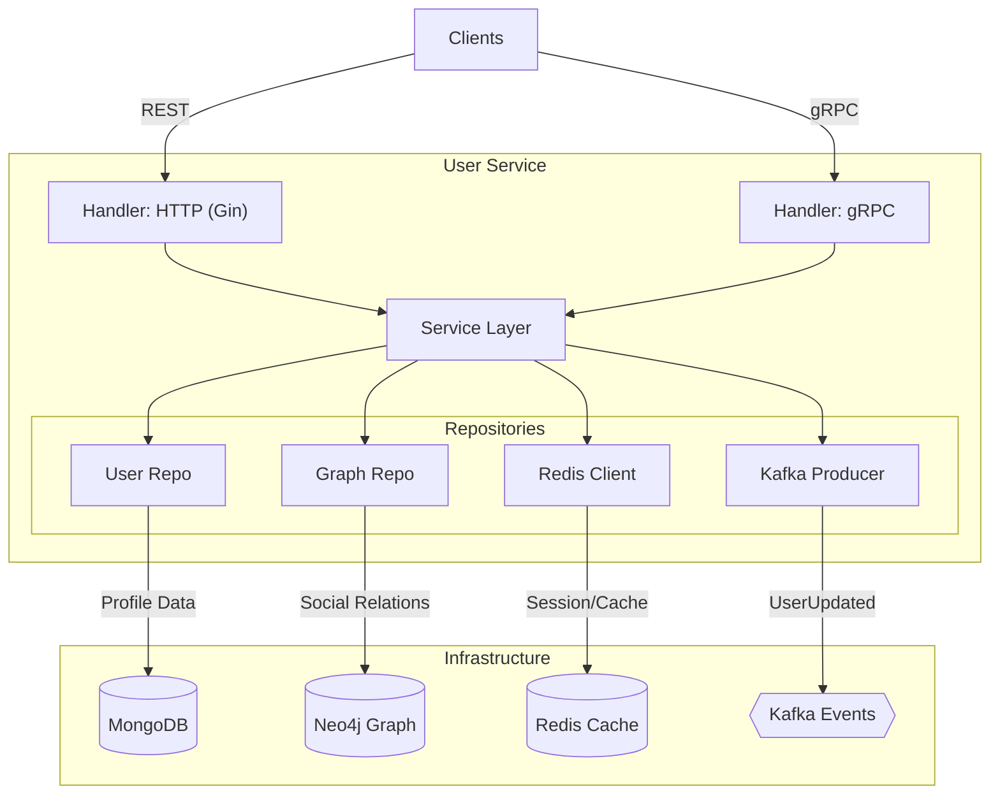

# User Service

The `user-service` is the central authority for user identity, profiles, and the social graph within the Connectify ecosystem. It uses a **Ports and Adapters** (Hexagonal) architecture to separate core business logic from transport layers (HTTP/gRPC) and infrastructure (databases).

## 🏗 Architecture

The service implements a **Dual-Write** strategy to maintain consistency between the document store (MongoDB) and the graph store (Neo4j).



## 🚀 Key Features

*   **Identity Management**: Handles Registration, Login, and JWT Token issuance via `AuthService`.
*   **Profile Management**: CRUD operations for user profiles using MongoDB as the source of truth.
*   **Social Graph**:
    *   Manages Friends, Follows, and Blocks.
    *   Syncs relationships to **Neo4j** for high-performance graph traversal (O(1) lookups).
*   **Event-Driven**: Emits `UserUpdated` events to Kafka to allow other services (like the Monolith cache) to stay consistent.
*   **Dual-Protocol**:
    *   **HTTP**: For frontend clients (Registration, Profile Edits).
    *   **gRPC**: For inter-service communication (High-performance internal lookups).

## 🛠 Tech Stack

*   **Language**: Go (Golang)
*   **Framework**: Gin (HTTP)
*   **RPC**: gRPC + Protobuf
*   **Databases**:
    *   **MongoDB**: User Profiles
    *   **Neo4j**: Social Graph
    *   **Redis**: Caching & Sessions
*   **Messaging**: Kafka

## 📂 Directory Structure

```text
user-service/
├── cmd/
│   └── api/            # Entry point (main.go)
├── config/             # Configuration loader
├── internal/
│   ├── handler/        # Transport Layer (Ports)
│   │   ├── http/       # REST Handlers
│   │   └── grpc/       # gRPC Handlers
│   ├── service/        # Business Logic
│   ├── repository/     # Data Access (Adapters)
│   └── events/         # Kafka Producer
└── proto/              # (Legacy/Refactored) - See shared-entity
```

## 🔧 Configuration

The service is configured via environment variables.

| Variable | Description | Default |
|----------|-------------|---------|
| `PORT` | HTTP Server Port | `8083` |
| `MONGO_URI` | MongoDB Connection String | - |
| `NEO4J_URI` | Neo4j Connection String | - |
| `REDIS_URL` | Redis Connection String | - |
| `KAFKA_BROKERS` | Comma-separated broker list | - |
| `USER_UPDATED_TOPIC` | Topic for profile events | `user.updated` |
