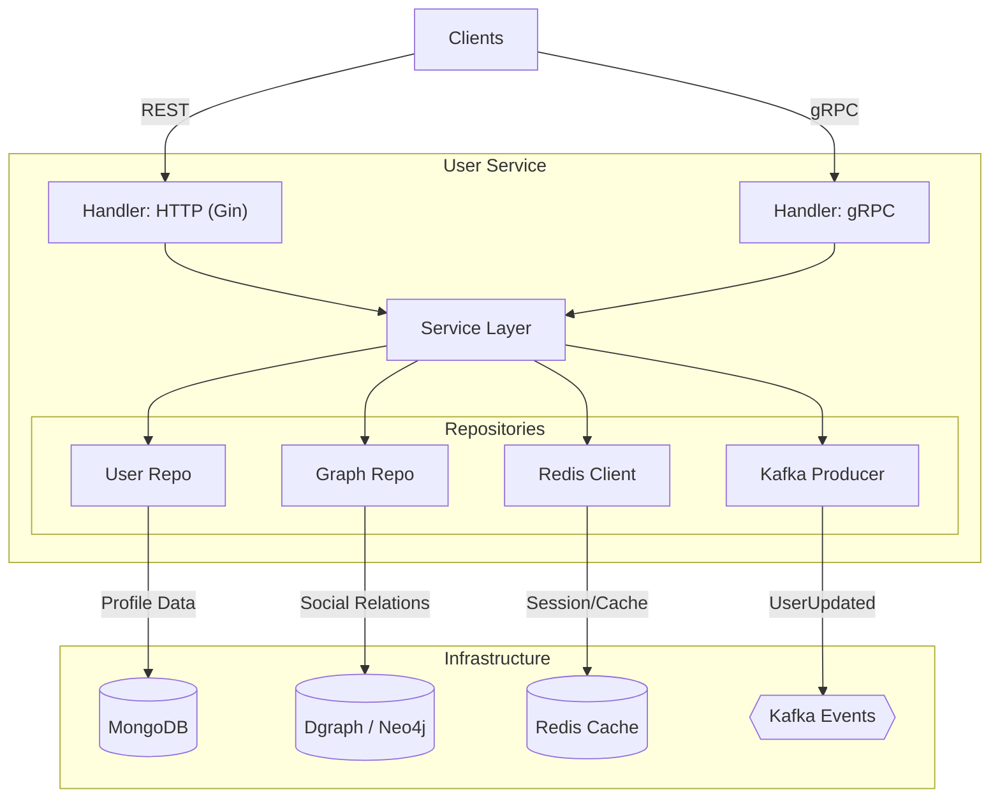

# User Service

The `user-service` is the central authority for user identity, profiles, and the social graph within the Connectify ecosystem. It uses a **Ports and Adapters** (Hexagonal) architecture to separate core business logic from transport layers (HTTP/gRPC) and infrastructure (databases).

## 🏗 Architecture

The service implements a **Dual-Write** strategy to maintain consistency between the document store (MongoDB) and the graph store (Neo4j).


```mermaid
graph TD
    Client[Clients]
    subgraph "User Service"
        H_HTTP["Handler: HTTP (Gin)"]
        H_GRPC["Handler: gRPC"]
        Service[Service Layer]
        
        subgraph "Repositories"
            R_User[User Repo]
            R_Graph[Graph Repo]
            R_Redis[Redis Client]
            R_Kafka[Kafka Producer]
        end
    end

    subgraph "Infrastructure"
        Mongo[(MongoDB)]
        DgraphNeo4j[(Dgraph / Neo4j)]
        Redis[(Redis Cache)]
        Kafka{{Kafka Events}}
    end

    Client -->|REST| H_HTTP
    Client -->|gRPC| H_GRPC

    H_HTTP --> Service
    H_GRPC --> Service

    Service --> R_User
    Service --> R_Graph
    Service --> R_Redis
    Service --> R_Kafka

    R_User -->|Profile Data| Mongo
    R_Graph -->|Social Relations| DgraphNeo4j
    R_Redis -->|Session/Cache| Redis
    R_Kafka -->|UserUpdated| Kafka
```

## 🚀 Key Features

*   **Identity Management**: Handles Registration, Login, and JWT Token issuance via `AuthService`.
*   **Profile Management**: CRUD operations for user profiles using MongoDB as the source of truth.
*   **Social Graph**:
    *   Manages Friends, Follows, and Blocks.
    *   Syncs relationships to **Dgraph** or **Neo4j** for high-performance graph traversal (O(1) lookups).
*   **Event-Driven**: Emits `UserUpdated` events to Kafka to allow other services (like the Monolith cache) to stay consistent.
*   **Dual-Protocol**:
    *   **HTTP**: For frontend clients (Registration, Profile Edits).
    *   **gRPC**: For inter-service communication (High-performance internal lookups).

## 🛠 Tech Stack

*   **Language**: Go (Golang)
*   **Framework**: Gin (HTTP)
*   **RPC**: gRPC + Protobuf
*   **Databases**:
    *   **MongoDB**: User Profiles
    *   **Dgraph / Neo4j**: Social Graph (Configurable)
    *   **Redis**: Caching & Sessions
*   **Messaging**: Kafka

## 📂 Directory Structure

```text
user-service/
├── cmd/
│   └── api/            # Entry point (main.go)
├── config/             # Configuration loader
├── internal/
│   ├── handler/        # Transport Layer (Ports)
│   │   ├── http/       # REST Handlers
│   │   └── grpc/       # gRPC Handlers
│   ├── service/        # Business Logic
│   ├── repository/     # Data Access (Adapters)
│   └── events/         # Kafka Producer
└── proto/              # (Legacy/Refactored) - See shared-entity
```

## 🔧 Configuration

The service is configured via environment variables.

| Variable | Description | Default |
|----------|-------------|---------|
| `PORT` | HTTP Server Port | `8083` |
| `MONGO_URI` | MongoDB Connection String | - |
| `NEO4J_URI` | Neo4j Connection String | - |
| `GRAPH_DB` | Graph Backend (`neo4j` or `dgraph`) | `dgraph` |
| `DGRAPH_ADDR` | Dgraph Alpha Address | `localhost:9080` |
| `REDIS_URL` | Redis Connection String | - |
| `KAFKA_BROKERS` | Comma-separated broker list | - |
| `USER_UPDATED_TOPIC` | Topic for profile events | `user.updated` |

**Token Policy**
- Access tokens default to 5 minutes (`ACCESS_TOKEN_TTL`) and are always checked against the Redis blacklist during `/users/me` calls.
- Refresh tokens default to 24 hours (`REFRESH_TOKEN_TTL`), rotate on every refresh, and are stored under `refresh:<userID>` in Redis; loss of Redis invalidates refreshes (fail-closed).
- When Redis (blacklist) is unreachable, privileged `/users/me` routes fail with `503` so revoked sessions cannot mutate profiles.

## 📊 Rate-Limit Telemetry

Rate limiting is observable via `user_service_rate_limit_hits_total{action="<scope>"}`. Each counter increments when a request is throttled:

| Action | Scope | Suggested Alert |
|--------|-------|-----------------|
| `user:global` | Global IP limiter (entire HTTP server) | `rate(...[5m]) > 5` indicates flooding |
| `auth:register` | `/api/v1/auth/register` | Alert if >1 hit/min (bot signup) |
| `auth:login` | `/api/v1/auth/login` | Alert if >5 hits/min (credential stuffing) |
| `auth:refresh` | `/api/v1/auth/refresh` | Alert if >3 hits/min (token churn) |

**Grafana panels**
1. `sum by (action)(increase(user_service_rate_limit_hits_total{action=~"auth:.*"}[5m]))` – visualize auth throttles.
2. `rate(user_service_rate_limit_hits_total{action="user:global"}[1m])` – global flood trend with alert if sustained above baseline for >10 minutes.

Documenting these series ensures SREs can wire them into dashboards/alerts immediately after deploy.
